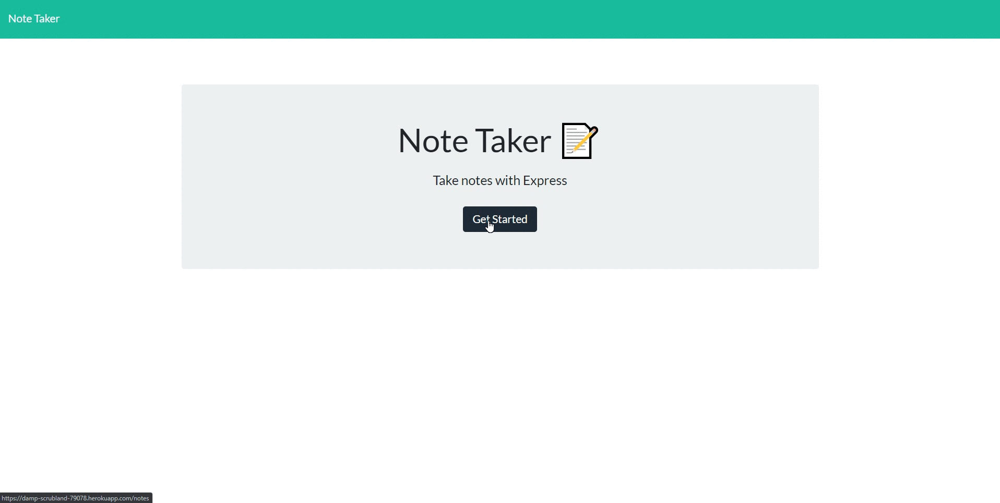

# Note Taker
## Description

An application that allows users to write, save and delete notes so that they are constantly reminded with important tasks to complete and remove those that are accomplished. It uses an express backend and save and retrieve note data from a JSON file

[](https://www.gnu.org/licenses/gpl-3.0)


## Installation

Make sure that Node.js is installed, then run this in the terminal
```
npm install
```

## Usage

Choose either of the following options to access the application:
1. Run 'node server.js' in terminal
2. Access live site [here](https://damp-scrubland-79078.herokuapp.com)!


## License

License for this project: GNU GPLv3

## Contributing

1. Fork/Clone this repo
2. Hack away!
3. Create a new pull request
4. Good commits will be accepted

## Testing




## Questions

If you have any questions/doubts, feel free to contact me via:
* GitHub: [https://github.com/ZanHong](https://github.com/ZanHong)
* Email: [mokzanhong92@hotmail.com](mailto:mokzanhong92@hotmail.com)
